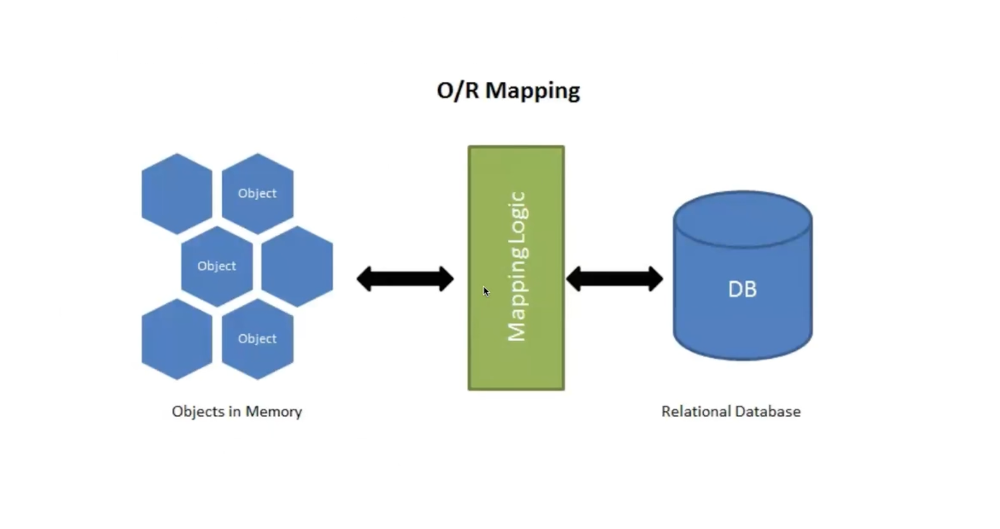

---

title: "01_components_props"
output:
  theme: white

--- 

# ORMs

---

## Lecture Objectives

- Demonstrate configuring an application to connect with sqlite3
- Demonstrate a create table method 
- Review preventative measures for SQL injection
- Demonstrate a save and create methods  
    - Save => Persist created instance to DB
    - Create => Instantiate / persist created instance to DB, return new instance 
- Demonstrate query methods to find and retrieve resources 
- Stretch Goal
    - Make a “create_and_find_by” member
    - Make “update” and “delete” member

--- 

<aside class="notes">

- 🛑 mapping SQL logic to separate methods that are easier to call using Python
</aside>

---

## Object-Relational Mapping

<aside class="notes">

- later on won't have to write by hand - will be using SQLAlchemy
- we are writing them today just to learn how it works
</aside>

---

<aside class="notes">
</aside>