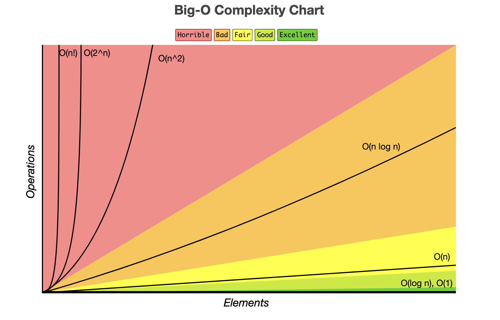

---

title: '01_intro_to_python'

---

# Intro to Python

---

## ✅ Phase 3 Objectives 

- Understand the principles of Python as a language 
- Understand the principles of Object Oriented Programming
- Understand the characteristics of a relational database and SQL
- Perform CRUD actions on a database
- Use a relational database to create a CLI (command line interface)

---

## Python Fundamentals

- Introduce Python 
- Demonstrate Python package management with pip 
- Demonstrate debugging in Python with shell, print, and ipdb
- Review Python data types
- Demonstrate Python conditionals, control flow, functions, variable scope, global scope, error messages and exceptions, and handling errors with try/except

---

## Virtual Environment

- `pyenv` - allows you to manage multiple Python versions, if you ever need to install a particular version of Python this is what you will use (ex. `pyenv install 3.8.1`)

- `pip` - package installer for python 

- `virtualenv` - allows you to create isolated Python environments, needs to be installed with `pip`...`venv` is the default installed with Python

- `pipenv` - combines virtualenv with pip, allows you to create virtual environments and manage Python packages.  Use `exit` to exit

src: https://betterstack.com/community/questions/what-are-differences-between-python-virtual-environments/

<aside class="notes">
- venv - is a built-in module in Python 3.3 and later versions that allows you to create isolated Python environments. It is similar to virtualenv, but it is installed by default with Python. 
- pyvenv -  is a script that comes with Python 3.3 and later versions that allows you to create virtual environments. It is a wrapper 
</aside>

---

| Python                                                                                               | Javascript                                                                                   |
|------------------------------------------------------------------------------------------------------|----------------------------------------------------------------------------------------------|
| None                      | undefined/null    |
| &&                        | and               |
| \|\|                      | or                |
| == (no type checking)     | === (type checking) |
| True/False                | true/false           |
| ipdb.set_trace()          | debugger          |
| snake_case                | camelCase         |
| f"{interpolate}"    | \`${interpolate}\`       |
| "true result" if "condition" else "default"   | "condition" ? "true result" : "default result"   |
| if...elif...else    | if...else if...else    |
| try...except... | try...catch...  |
| def:                     | function{}         |
| If a function has params you have to pass in args for those params (otherwise you can set a default) | If a function has params JS will not throw errors if you do not pass in args for said params |
| Variables need to immediately be assigned a value when created | Variables do not need to be immediately assigned a value when created |

---

## Testing

- `python` - opens sandbox in terminal, does not contain environment from your .py files

- `ipdb` - has to be imported, creates a breakpoint when you run `file.py`

- `print` - similar to `console.log` but will print to the console

---

## Big 'O' Notation

- The runtime of common algorithms
- 'O' is for 'order'.  It is NOT the number 0

