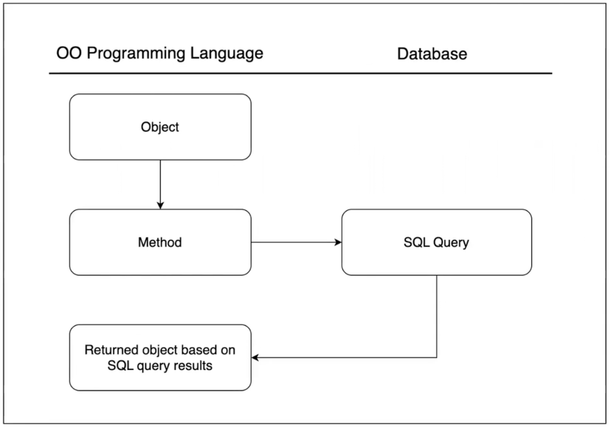
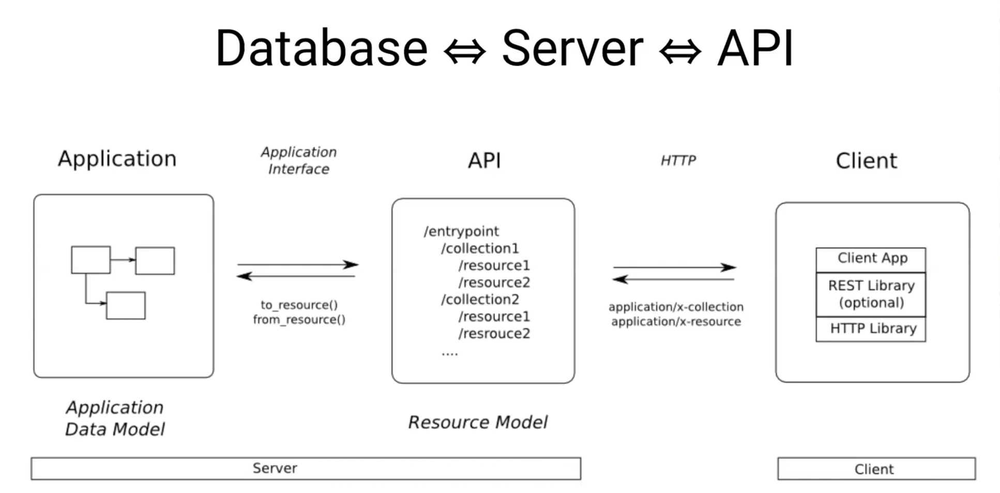

---

theme : "night"
transition: "slide"
highlightTheme: "monokai"
slideNumber: false
title: "01_function_scope"

---

# SQL

<aside class="notes">

- MAKE SURE EVERYONE HAS SQLITE VIEWER and SQLITE VS CODE EXTENSION
- use sqlite for running queries tutorial below:
- https://www.youtube.com/watch?v=bKixKfb1J1o

</aside>

---

## Learning Objectives

- Explain why we use databases
- Explain what SQL is and why we use it
- Explain the difference between a database, server, and API
- Explain the difference between rows and columns in a table
- Explain the difference between a foreign key and primary key
- Explain what a join table is
- Explain what it means to seed a database
- Observe using SQL to communicate with a database
- Explain what an ORM is and why we use Active Record

<aside class="notes">

- FK, PK are essential for relations between tables
- Join table for veterinary clinic (appts, owners, pets)
- Generate seed data 
</aside>

---

## What are the key benefits of using databases in applications?

<aside class="notes">

- storage, persisting data
- versatile: work with data in flexible ways
- CRUD
- will later use Python to follow CRUD actions
</aside>

---

## What are the key benefits of using databases in applications?

- Databases allow us to store and perform CRUD actions on data outside of our code, allowing our changes to persist to the next session.

---

## Where We're Going

<aside class="notes">

- object relational mapping
- we will create Python methods that will fire SQL queries (CRUD actions)
- objects will be returned to us
- WE USED JSON TO STORE DATA IN PHASE 1 & 2, we will create more complex data
</aside>

---

<aside class="notes">

- client will still handle rendering
- we want requests to specific endpoints to fire off specific actions
</aside>

---

<aside class="notes">

- 💡 what does PK stand for? 
- 💡 what is clinic_id?
</aside>

---

## Good vs Bad Data

<aside class="notes">

- 💡 why is this bad data?
1. redundancy: can break out owner info into new table
2. duplicate of info (luke)
3. structure: everything is in one table, cluttered, not specific enough to what the table is meant to represent, awkward to access info 
</aside>

---

## Good vs Bad Data

<aside class="notes">

- 💡 why is this bad data?
1. not parsing apart info, multiple pet names, pet ages under one owner
2. not sure which pet age corresponds to which pet name
- break info apart 
</aside>

---

## Better Approach

 
<aside class="notes">

- owner_id is the FK
</aside>

---

## One to Many

<aside class="notes">

- easier to represent owners by unique ID
</aside>

---

## Many to Many

<aside class="notes">

- additional table represents the joining of two pieces of data in two other individual tables
</aside>

